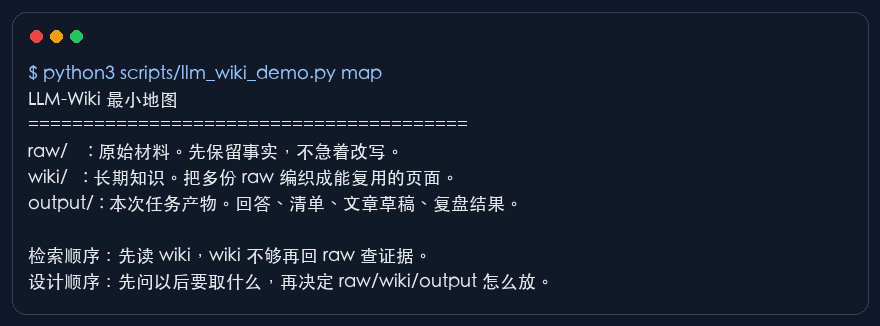
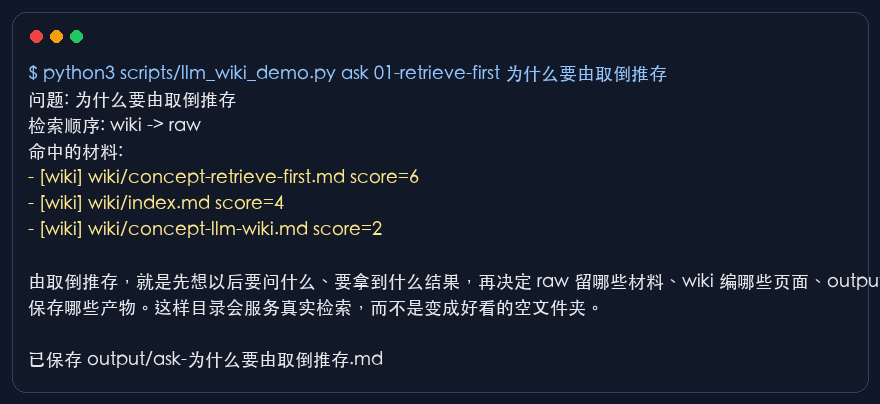
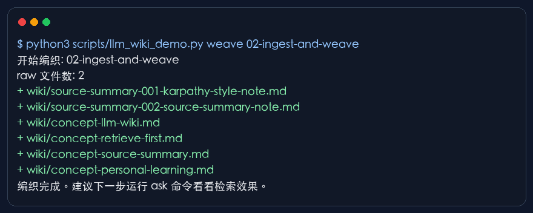
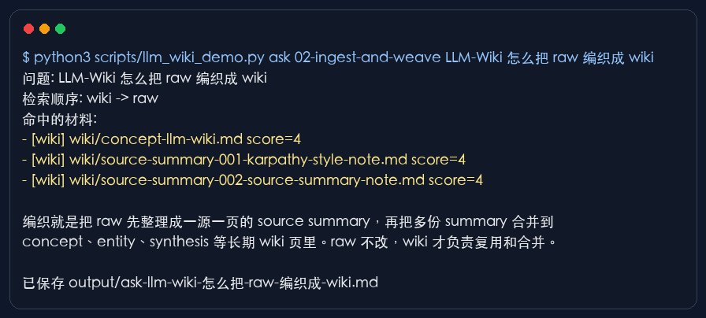
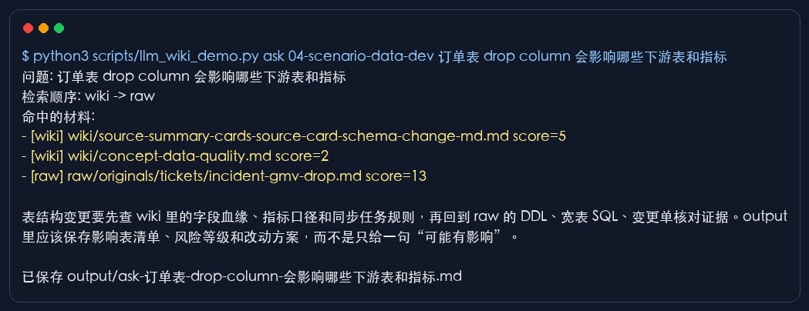
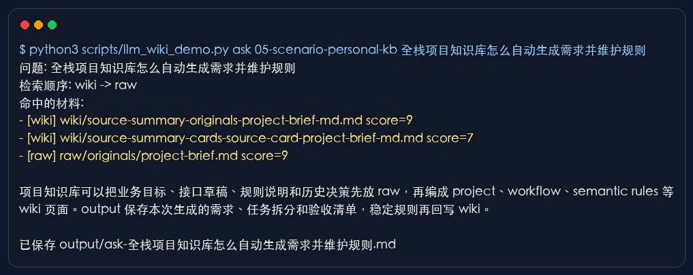

# 从 raw / wiki / output 开始：用终端跑通一个 LLM-Wiki 最小 MVP

上一篇聊 Karpathy 的 LLM-Wiki 时，我重点讲了一件事：

> LLM-Wiki 的第一步，是定义知识未来怎么被调用，目录可以稍后再搭。

这句话如果只停在理论层，很多新手还是会卡住。

因为一到动手阶段，问题会马上变成另一组更具体的选择：

- 我到底先建哪些目录？
- raw、wiki、output 分别放什么？
- wiki 是怎么从原始资料里编织出来的？
- 检索时为什么先读 wiki，再回 raw 查证据？
- output 保存的是回答、报告，还是长期知识？
- 数据开发、个人知识库这些场景，怎么从最小结构自然演进出来？

所以这篇不继续讲抽象概念。

我们直接从一个可以运行的本地目录开始。

案例目录在：

```bash
/Users/mac/Documents/OriginOne-Demo/OriginOne-Wiki
```

后续这套内容可以推到 `originoneai/originone-demo`，作为一个给新手看的 LLM-Wiki 0-1 终端案例。

这版先不接 Obsidian，也不接数据库、向量库、外部模型 API。脚本用确定性规则模拟 LLM-Wiki 的几个核心动作：`map`（看结构）、`weave`（编织）、`ask`（检索提问）。

这样做的目的很直接：先让读者看到文件真的进入了 raw，wiki 真的生成了长期页面，output 真的保存了一次任务结果。

**LLM-Wiki 的 0-1，不应该先卡在工具选择上。第一步要让一次知识调用闭环跑起来。**

## 一、先把最小环境跑起来

进入项目目录：

```bash
cd /Users/mac/Documents/OriginOne-Demo/OriginOne-Wiki
```

先看项目提供了哪些阶段：

```text
OriginOne-Wiki/
├── 00-minimal-raw-wiki-output/
├── 01-retrieve-first/
├── 02-ingest-and-weave/
├── 03-output-and-reuse/
├── 04-scenario-data-dev/
├── 05-scenario-personal-kb/
├── assets/screenshots/
├── article/
├── design-package/
└── scripts/
```

前四个阶段只做基础动作。

04 和 05 再把这套结构放到两个更真实的场景里：

- 数据开发场景：DDL、宽表 SQL、表结构变更、字段映射健康报告、影响分析。
- 个人/项目知识库场景：原件、source card（来源卡片）、规则、语义层、需求生成。

先运行最小地图：

```bash
python3 scripts/llm_wiki_demo.py map
```

运行截图如下：



这里先记住三个目录。

```text
raw/     原始材料
wiki/    编译后的长期知识
output/  本次任务产物
```

`raw` 可以理解成知识库里的原始证据层。它保存需求、聊天记录、SQL、DDL、会议纪要、报错日志、截图说明。raw 可以比较乱，但要尽量保真。

`wiki` 是编译后的知识层。Agent 或人读完 raw 后，把可复用的定义、规则、口径、方法、页面关系沉淀到 wiki。

`output` 保存一次任务的结果。比如一次回答、一份检查清单、一份字段映射报告、一份需求草案。output 不是长期知识本身，它是本轮调用的交付物。

这三个目录足够小，但已经覆盖了一套 LLM-Wiki 的基本闭环：

```text
资料进入 raw
知识编织到 wiki
任务结果保存到 output
```

## 二、为什么要从“取”倒推“存”

很多新手一开始会让 Agent 帮自己设计一个完整目录。

Agent 往往会给出一套很像样的结构：concepts、entities、projects、patterns、bad-cases、queries、reports、releases。

这些目录本身没有问题。

问题在于，初学者很容易把“可以这么放”误解成“起步必须这么放”。

上一篇理论稿里讲过一句话：

> 目录是未来调用方式在文件系统里的投影。

所以第一步不要问“我应该建哪些目录”。

先问：

> 我以后要从这里取出什么？

在这个 demo 里，01 阶段专门演示这件事：

```bash
python3 scripts/llm_wiki_demo.py weave 01-retrieve-first
python3 scripts/llm_wiki_demo.py ask 01-retrieve-first "为什么要由取倒推存"
```

截图如下：



这个阶段的 raw 里只有一份材料。

运行 `weave` 以后，脚本会把 raw 编成 wiki 页面。再运行 `ask`，脚本会先读 wiki，再补 raw 证据，最后把回答写进 output。

这里要让新手看懂一个动作：

**目录不是凭审美设计出来的，目录要被未来的检索问题倒推出来。**

如果未来只需要回答 raw、wiki、output 的区别，三个目录已经够用。

如果未来要做字段血缘影响分析，raw 里就会长出 DDL、SQL、变更单，output 里就会长出 health-check（健康检查）和 impact-analysis（影响分析）。

如果未来要自动生成项目需求，raw 里就会长出 originals（原件区）和 cards（来源卡片区），output 里就会长出 requirements（需求草案）和 diagnosis（任务诊断）。

目录不是一开始规划出来越多越好。

**调用问题变复杂以后，目录才有资格变复杂。**

## 三、raw 怎么被编织成 wiki

LLM-Wiki 里的一个关键动作叫 `weave`。

`weave` 可以翻译成“编织”。它的含义是：不要把 raw 原文直接当成长期知识，要先把原始材料整理成可复用、可链接、可检查的 wiki 页面。

在 02 阶段，运行：

```bash
python3 scripts/llm_wiki_demo.py weave 02-ingest-and-weave
```

截图如下：



脚本会做两层生成。

第一层是 `source-summary`（来源摘要）。

每一份 raw 会生成一份来源摘要。来源摘要会记录：

- 原始来源在哪里；
- 一句话摘要是什么；
- 这份 raw 适合进入哪些长期知识页；
- 人需要检查什么。

第二层是 `concept`（概念页）。

多份来源摘要会被合并到长期概念页里。比如 `concept-llm-wiki.md`、`concept-source-summary.md`。

这个过程可以简化成：

```text
raw/原始材料
  -> wiki/source-summary-*.md
  -> wiki/concept-*.md
  -> wiki/index.md
```

真正接入大模型以后，摘要、概念抽取、冲突识别、页面合并可以交给 LLM。

但早期不建议把文章重点放在“模型有多聪明”上。

更值得盯住的是生成物的形态：

- 每个 wiki 页面有没有来源；
- 概念页有没有混入未经确认的推断；
- 原始材料有没有被保留；
- 长期知识有没有稳定入口；
- 后续任务能不能复用这些页面。

**LLM-Wiki 的编织质量，不看页面写得多漂亮，先看来源能不能追、边界能不能查、下次能不能用。**

## 四、检索效果到底长什么样

继续在 02 阶段跑一次提问：

```bash
python3 scripts/llm_wiki_demo.py ask 02-ingest-and-weave "LLM-Wiki 怎么把 raw 编织成 wiki"
```

截图如下：



你会看到输出里有三类信息。

第一，问题本身。

```text
问题: LLM-Wiki 怎么把 raw 编织成 wiki
```

第二，检索顺序。

```text
检索顺序: wiki -> raw
```

第三，命中的材料。

```text
命中的材料:
- [wiki] wiki/concept-llm-wiki.md
- [wiki] wiki/source-summary-001-karpathy-style-note-md.md
- [raw] raw/001-karpathy-style-note.md
```

这个 demo 没有接向量检索，也没有接真实 LLM。它用简单关键词评分来模拟检索过程。

但这个简化不影响教学重点。

重点在于检索顺序：

```text
先读 wiki
wiki 不够，再回 raw 查证据
```

很多知识库失败，原因在于每次提问都回到原始材料里重新翻。

这会带来两个问题。

第一，模型上下文成本很高。每次都读一堆 raw，很多无关信息会混进来。

第二，知识没有沉淀。上一次已经确认过的定义、边界和经验，下次还要重新理解。

wiki-first（优先读 wiki）的价值在这里：长期知识先承担解释，raw 再承担证据校验。

**raw 负责可信来源，wiki 负责可复用理解，output 负责本次交付。**

## 五、output 保存什么，为什么不能直接当 wiki

03 阶段演示 output 的边界。

运行：

```bash
python3 scripts/llm_wiki_demo.py ask 03-output-and-reuse "output 保存什么 为什么不能直接当 wiki"
```

脚本会在下面这个目录写入一份回答：

```text
03-output-and-reuse/output/
```

output 的定位很容易被误解。

有些人会觉得，既然 Agent 生成了一段很好的回答，那就直接放进 wiki。

这一步要谨慎。

output 是一次任务产物，可能包含临时判断、局部上下文、未确认假设、面向本次交付的表达。它可以很有用，但进入 wiki 前需要检查。

最小检查可以问四个问题：

- 这次回答有没有引用来源？
- 引用来源能不能回到 raw？
- 里面有没有长期可复用的规则？
- 这条规则是否经过人确认？

只有反复会用、来源清楚、边界明确的内容，才应该回写到 wiki。

否则 wiki 会慢慢变成 output 的垃圾堆。

**output 的价值在验收，wiki 的价值在复用。把两者混在一起，知识库很快会腐烂。**

## 六、场景一：数仓日常工作怎么演进

跑通 00 到 03 后，可以进入第一个真实场景：数据开发。

这个场景不再只问“GMV 是什么口径”。

它模拟的是数仓工程师更常见的三类工作：

- 数据问题排查：GMV 为什么突然下降；
- 任务问题诊断：同步任务是不是因为字段变化失败；
- 数据需求开发：业务库表结构变更后，下游宽表、指标、语义层怎么改。

进入 04 阶段：

```text
04-scenario-data-dev/
  raw/
    originals/
      ddl/
      sql/
      tickets/
      schema-changes/
    cards/
  wiki/
  output/
    health-check/
    impact-analysis/
    diagnosis/
```

这里 raw 开始分层。

`raw/originals` 保存原始证据。包括 DDL、宽表 SQL、指标 SQL、事故单、表结构变更单。

`raw/cards` 保存 source card（来源卡片）。来源卡片不替代原文，它只是给 Agent 一个更稳定的入口，记录 `source_ref`（来源引用）、`status`（处理状态）、`trust`（可信度）、`owner`（负责人）等信息。

运行：

```bash
python3 scripts/llm_wiki_demo.py weave 04-scenario-data-dev
python3 scripts/llm_wiki_demo.py ask 04-scenario-data-dev "订单表 drop column 会影响哪些下游表和指标"
```

截图如下：



这个问题模拟的是一个真实的数据开发痛点：

业务库 `business_db.orders` 删除了 `refund_amount` 字段。下游 `dwd_order_wide_di`、`ads_gmv_daily`、退款指标和净 GMV 指标会不会受影响？

demo 里的原始材料包括：

```text
raw/originals/ddl/ods_order.sql
raw/originals/ddl/dwd_order_wide.sql
raw/originals/sql/ads_gmv_daily.sql
raw/originals/tickets/incident-gmv-drop.md
raw/originals/schema-changes/2026-06-21-order-drop-refund-amount.md
raw/cards/source-card-schema-change.md
```

这时 output 不应该只保存一句“可能有影响”。

它要保存可交付的排查结果：

```text
output/health-check/field-mapping-health-report.md
output/impact-analysis/order-drop-refund-amount.md
output/diagnosis/gmv-drop-diagnosis.md
```

字段映射健康报告里会直接标出风险：

| 下游字段 | 上游字段 | 状态 | 风险 |
|---|---|---|---|
| dwd_order_wide_di.refund_amount | orders.refund_amount | broken | 高 |
| dwd_order_wide_di.net_pay_amount | pay_amount - refund_amount | broken | 高 |
| ads_gmv_daily.refund_daily | dwd_order_wide_di.refund_amount | broken | 高 |
| ads_gmv_daily.net_gmv_daily | pay_amount - refund_amount | broken | 高 |

这里的 `broken` 是演示用状态，表示字段链路已经断裂。

对应修复建议也保存在 output 里：

1. 新增 `ods_order_refunds_di` 同步退款明细。
2. 在 DWD 层按 `order_id` 聚合退款金额。
3. 修改 `dwd_order_wide_di.refund_amount` 来源。
4. 重跑 `ads_gmv_daily`，并校验 `net_gmv_daily = gmv_daily - refund_daily`。

这个案例的重点不在 SQL 复杂度。

重点在数仓知识怎么被组织成可调用上下文：

- DDL 进 raw；
- 变更单进 raw；
- source card 建入口；
- wiki 沉淀字段血缘和 schema change（表结构变更）规则；
- output 保存本次健康报告和影响分析；
- 稳定规则再回写 wiki。

**数据开发场景里的 LLM-Wiki，真正要减少的是重复解释字段、重复翻 SQL、重复确认口径、重复踩表结构变更的坑。**

## 七、场景二：个人/项目知识库怎么演进

第二个场景是个人/项目知识库。

这里故意不做普通“读书笔记收藏夹”。

更接近真实诉求的场景是：一个开发者在做全栈项目，材料散在项目 brief（项目简述）、会议记录、接口草稿、规则文档里。后续希望大部分需求可以自动生成，但生成结果必须能追溯来源、维护规则、进入验收。

05 阶段的目录是：

```text
05-scenario-personal-kb/
  raw/
    originals/
    cards/
  wiki/
  output/
    requirements/
    rules/
    diagnosis/
```

运行：

```bash
python3 scripts/llm_wiki_demo.py weave 05-scenario-personal-kb
python3 scripts/llm_wiki_demo.py ask 05-scenario-personal-kb "全栈项目知识库怎么自动生成需求并维护规则"
```

截图如下：



这个阶段的 raw 里有四类原件：

```text
raw/originals/project-brief.md
raw/originals/meeting-notes.md
raw/originals/api-sketch.md
raw/originals/rules-and-semantic-layer.md
```

还有两张 source card：

```text
raw/cards/source-card-project-brief.md
raw/cards/source-card-rules.md
```

source card 的意义在于给原件建立检索入口。

比如项目 brief 的 source card 会记录：

- 项目目标；
- MVP 功能；
- 非目标；
- 可信度；
- 处理状态；
- 关联 wiki 页面。

output 里会保存三类交付物：

```text
output/requirements/generated-requirements.md
output/rules/rules-maintenance-checklist.md
output/diagnosis/task-diagnosis.md
```

`generated-requirements.md` 是一次需求生成结果。

这份需求草案必须引用 source card，并保留验收清单：

- 导入材料后，原文没有被改写；
- source card 包含 `source_ref`、`status`、`trust`、`owner`；
- `unprocessed`（未处理）材料默认不进入自动需求生成；
- 生成的需求必须列出 `source_refs`（引用来源）。

这一点非常关键。

很多人做个人知识库，真正的问题不在“资料少”，也不在“检索弱”。

问题在于，资料没有被转成可执行规则和可验收输出。

项目知识库里的 LLM-Wiki 要承担三件事：

- 保留原件，避免来源丢失；
- 编译长期规则，避免每次重新解释项目背景；
- 生成本次交付物，并明确哪些内容能回写 wiki。

**个人知识库一旦进入项目执行阶段，收藏能力只算基础能力，规则维护和任务验收才会决定它能不能长期使用。**

## 八、这套 demo 的边界要讲清楚

这套案例是真实可运行的终端 demo，但它不是完整产品。

它有几个明确边界。

第一，脚本没有调用真实 LLM。

`scripts/llm_wiki_demo.py` 用关键词规则模拟摘要、概念归类和检索。这样做是为了让新手先跑通结构，避免第一步被 API Key、模型额度、网络环境挡住。

第二，检索不是生产级检索。

demo 里的 `ask` 使用简单评分，并强制 wiki-first。真实系统可以接 BM25、向量检索、混合检索、重排模型，但这些技术都应该服务检索契约，而不是反过来定义目录。

第三，wiki 编织需要人检查。

source summary（来源摘要）可能误读原文，concept（概念页）可能合并过度，output 可能包含未确认假设。demo 会在生成页面里写出“人要检查什么”，就是为了让新手看到这个边界。

第四，场景 04 和 05 仍然是最小切片。

数仓场景只围绕订单退款字段变更演示，不覆盖完整数据平台。

项目知识库场景只围绕需求生成和规则维护演示，不覆盖完整研发管理系统。

这些边界不能省略。

**新手做 LLM-Wiki，最怕把演示当生产，把一次回答当长期知识，把目录完整当系统完成。**

## 九、从 0 到 1 到 100，怎么继续升级

这套 demo 的演进路线可以分成四层。

### Level 0：终端最小闭环

目标是让读者亲手跑通：

```text
raw -> wiki -> output
```

这一层只需要 Markdown、Python 脚本、终端截图。

验收标准很简单：

- raw 里有原始材料；
- weave 能生成 source summary 和 concept；
- ask 能先命中 wiki，再回 raw；
- output 能保存本次结果；
- 截图能证明流程真的跑过。

### Level 1：接入真实 LLM

把脚本里的规则摘要替换成真实模型调用。

但要保留当前的输出形态：

- 每份 raw 生成 source summary；
- 每个 source summary 有 source_ref；
- concept 页面有证据来源；
- output 有引用来源和人工检查项。

模型可以变，知识契约不能随便变。

### Level 2：增加 Health-Check

Health-Check 可以翻译成健康检查。

它要检查知识库有没有腐烂：

- source summary 缺来源；
- wiki 页面没有证据；
- output 没有引用；
- source card 缺 status 或 trust；
- schema change 影响分析没有落到具体对象；
- 需求生成没有验收清单。

上一篇理论稿里讲的 MVP 验收标准，在这里就能落到文件系统里。

页面数量排后，调用稳定性排前。

### Level 3：场景化扩展

数仓场景可以继续扩展：

- 字段血缘 parser；
- DDL diff（表结构差异）；
- 指标口径冲突检查；
- 调度失败诊断；
- 语义层规则回写；
- Doris / Hive / Spark SQL 的 explain 结果沉淀。

项目知识库场景可以继续扩展：

- source card 审批状态；
- rules 版本记录；
- requirements 自动生成；
- task diagnosis；
- release note；
- handoff（交接包）。

这一层才需要认真考虑 Obsidian、Web UI、数据库、向量库、权限系统、MCP（模型上下文协议）和自动化调度。

**先把调用闭环跑通，再升级技术栈。这个顺序能减少很多早期返工。**

## 十、最后给新手一组最小命令

如果你只想先跑一遍，按下面顺序执行：

```bash
cd /Users/mac/Documents/OriginOne-Demo/OriginOne-Wiki

python3 scripts/llm_wiki_demo.py map

python3 scripts/llm_wiki_demo.py weave 02-ingest-and-weave
python3 scripts/llm_wiki_demo.py ask 02-ingest-and-weave "LLM-Wiki 怎么把 raw 编织成 wiki"

python3 scripts/llm_wiki_demo.py weave 04-scenario-data-dev
python3 scripts/llm_wiki_demo.py ask 04-scenario-data-dev "订单表 drop column 会影响哪些下游表和指标"

python3 scripts/llm_wiki_demo.py weave 05-scenario-personal-kb
python3 scripts/llm_wiki_demo.py ask 05-scenario-personal-kb "全栈项目知识库怎么自动生成需求并维护规则"
```

如果要重新生成截图：

```bash
/Users/mac/miniconda3/bin/python3 scripts/make_terminal_screenshots.py assets/screenshots/*.txt
```

如果要验证设计包：

```bash
python3 /Users/mac/.codex/skills/originoneai-llm-wiki-builder/scripts/validate_wiki_plan.py design-package
```

这篇实操文想让新手先建立一个很朴素的判断：

**LLM-Wiki 不是从工具开始，也不是从大而全目录开始。它从一次可验收的知识调用开始。**

先让一份 raw 进入，让一页 wiki 生成，让一次 output 保存。

再让这套闭环进入数据开发、项目知识库、团队协作、语义层和 Agent 工作流。

知识库什么时候开始有价值？

当它让 Agent 少问一次背景，少读一批脏上下文，少重复一个旧坑，少在中断后失忆一次。

走到这一步，raw、wiki、output 就不再是三个文件夹。

它们会变成知识进入、知识沉淀和知识调用的最小系统。
